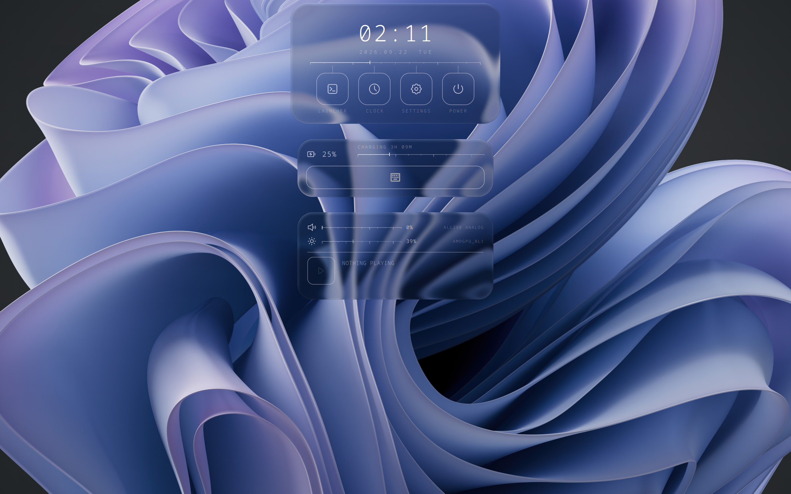

<div align="center">
<h2>Shoji Bar 3</h2>

The default desktop shell for [ShojiWM](https://bea4dev.github.io/ShojiWM/).



</div>

## Requirements

- **quickshell** 0.3.1 or later — everything is drawn by it.
- **qt6-shadertools** (`qsb`) — to compile the island shader once at build time.

Everything else is optional: a panel simply shows nothing where the service is
missing.

| Used for | Needs |
| --- | --- |
| Lock screen | a PAM `login` config (standard on most distributions) |
| Clipboard history | `cliphist`, `wl-clipboard` |
| Network / Bluetooth panes | NetworkManager, BlueZ |
| Power profiles | `power-profiles-daemon` |
| Volume, media | PipeWire, any MPRIS player |
| Wallpaper | pictures in `~/Pictures/wallpaper` |

Text is set in **Noto Sans Mono**.

## Install

```sh
git clone https://github.com/bea4dev/shoji-bar-3 ~/.config/shoji-bar-3
cd ~/.config/shoji-bar-3
bash run.sh          # builds the shader, then runs the shell
```

`run.sh` is only a convenience. Once the shader is built, `quickshell --path .`
is enough; the built `.qsb` is not in the repository, so `build.sh` has to run
at least once.

To start it with the session, add it to your ShojiWM config:

```ts
COMPOSITOR.process.once("shell", {
  command: "cd ~/.config/shoji-bar-3 && bash build.sh; exec quickshell --path .",
  runPolicy: "once-per-session",
});
```

The `;` is deliberate: if the shader fails to build, starting with the previous
one is better than a session with no shell in it.

## Compositor effects

The bar draws a translucent silhouette and lets the compositor recover the
shape from its alpha, so it wants the island glass behind it. The wallpaper
wants nothing behind it at all. Both are addressed by layer namespace:

```ts
COMPOSITOR.effect.layer = (layer) => {
  const namespace = layer.namespace();
  if (namespace === "shoji-bar-3") return { behind: ISLAND_GLASS };
  if (namespace === "no_blur") return {};        // the wallpaper
  return { behind: LAYER_BLUR_MASK };
};
```

The match is exact, not a substring.

## IPC

The bar answers on Quickshell's IPC socket, addressed by the config path rather
than by a running instance id:

```sh
quickshell -p ~/.config/shoji-bar-3 ipc show      # lists everything below
```

| Target | Call | Does |
| --- | --- | --- |
| `launcher` | `open` / `close` / `toggle` | the application launcher |
| `launcher` | `clipboard` | the same panel, pointed at the clipboard history |
| `session` | `lock` | locks the session |

Every `launcher` call has an `...On <screen>` form — `openOn`, `toggleOn`,
`clipboardOn` — taking a connector name (`eDP-1`, `DP-3`) so the panel opens on
the monitor you are looking at. Without it, it opens on every screen.

There is no `unlock`: a socket that could unlock the session would make the
lock screen decorative.

## Keys

Nothing is bound inside the bar — the compositor calls in. In ShojiWM:

```ts
function toggleLauncher() {
  const monitor = HYBRID_WINDOW_MANAGER.getCurrentMonitorName();
  COMPOSITOR.process.spawn({
    command: `quickshell -p ~/.config/shoji-bar-3 ipc call launcher toggleOn "${monitor}"`,
  });
}

COMPOSITOR.key.bind("launcher", "Super+A", toggleLauncher);
// Fires on release, and only if no other key was pressed in between.
COMPOSITOR.key.bind("launcher-tap", "Super", toggleLauncher, { on: "release" });

COMPOSITOR.key.bind("clipboard", "Super+V", () => {
  const monitor = HYBRID_WINDOW_MANAGER.getCurrentMonitorName();
  COMPOSITOR.process.spawn({
    command: `quickshell -p ~/.config/shoji-bar-3 ipc call launcher clipboardOn "${monitor}"`,
  });
});

COMPOSITOR.key.bind("lock", "Super+L", () => {
  COMPOSITOR.process.spawn({
    command: "quickshell -p ~/.config/shoji-bar-3 ipc call session lock",
  });
});
```

Clipboard history needs the watchers running. ShojiWM can keep them up:

```ts
COMPOSITOR.process.service("cliphist-text", {
  command: ["wl-paste", "--type", "text", "--watch", "cliphist", "store"],
  restart: "on-exit",
});
COMPOSITOR.process.service("cliphist-image", {
  command: ["wl-paste", "--type", "image", "--watch", "cliphist", "store"],
  restart: "on-exit",
});
```

## Dock

Push the pointer to the bottom of the screen and the dock comes up: one square
per application, and under them a rule carrying one mark per open window.

| | |
| --- | --- |
| Left click | show the application, or start it if nothing is open; click again to step through its windows |
| Middle click | open another window |
| Right click | a menu: pin it, unpin it, start another window, or close it |
| Drag | move a pinned application along the row |

A pinned application stays in the row with nothing open, shown by a hollow
mark; everything before the divider is pinned. Windows come from
`zwlr_foreign_toplevel_management_v1` and are grouped by desktop entry, which
is also what a pin is stored as, so a pin survives both a restart and the
application's windows closing.

## Configuring

Every number the shell is drawn from — sizes, spacing, colours, and the timing
of every animation — is a variable in `theme.js`, and the rest is derived from
it. Change one and the layout recomputes itself.

State the shell keeps for you (currently the chosen wallpaper) lives in
`~/.local/state/quickshell/by-shell/<id>/`.
